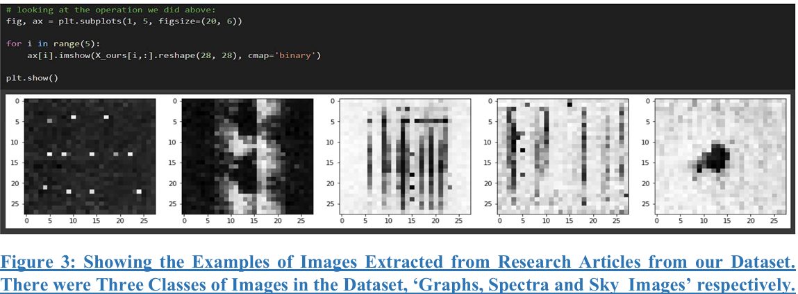
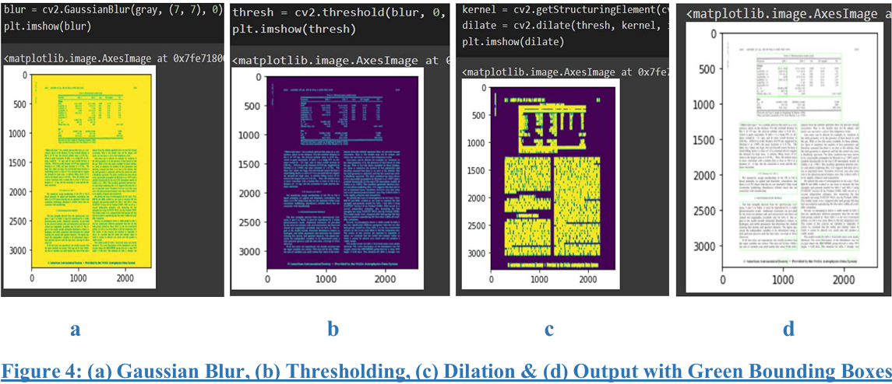
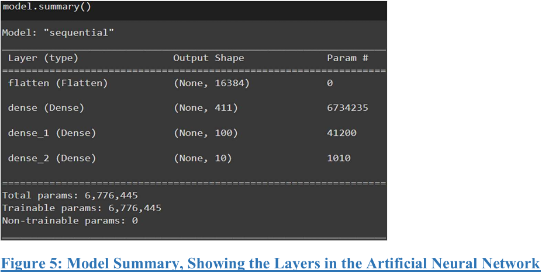
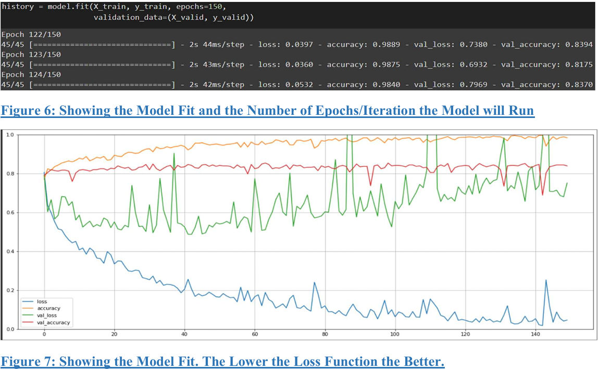
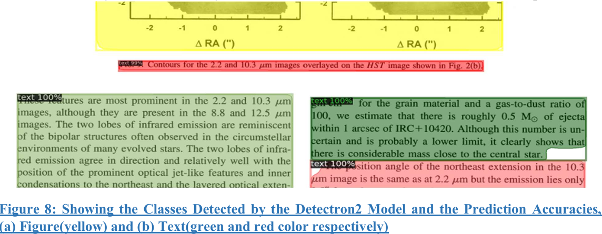
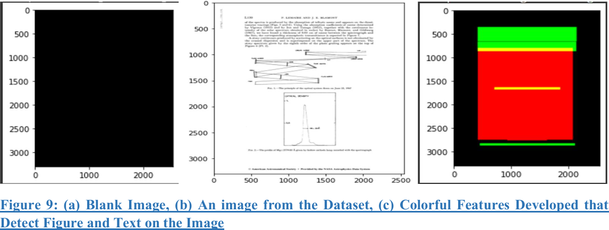
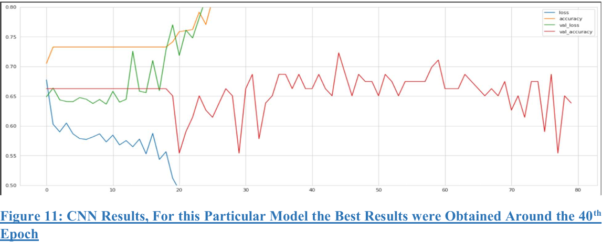
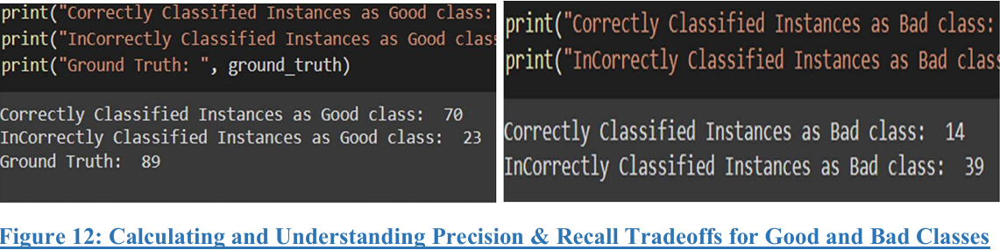
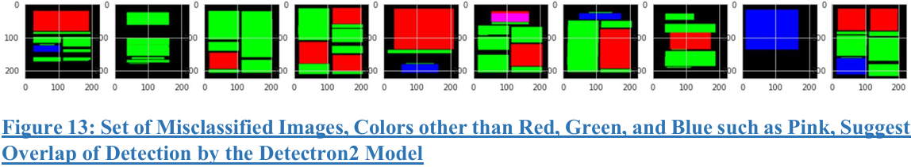

# Figure_Layout_Classification_ML_DL

#### Digitized pre-digital astrophysics literature (research papers published before 1997) using NASA's Astrophysics Dataset System. Streamlined the project with advanced machine learning models using Detectron2, Sklearn, and TensorFlow to automate, and enhanced the data filtering pipeline by 82%. Executed functionalities by performing binary and multi-class classification on image datasets, resulting in an overall operational accuracy of 70%.

### Some more information on the project:

#### The dataset comes from the Astrophysics Data System(ADS), an online database of around eight million astronomy and physics-related research papers. The second and major part involves Document Image Analysis using object detection algorithms. 

### Machine Learning and Deep Learning Models used: 

#### The project involves the detection of different classes like 'text,' 'title,' 'list,' 'table,' and 'figure' that can be detected accurately by the ML models, on PDF Pages. The image annotation process needs to be fully automated, the less use of human annotators, the better. Machine learning classification methods/algorithms are used to detect text and figures in these research papers and extract information from them. Citizen science is also involved in this method. 

#### The project involves creating a pipeline where datasets would be developed and put on the Zooniverse site (open source), which astronomers, researchers, or students can use for their research work. There are 10s of thousands of research papers that need to be digitized in this way. 

### Code File for Classification on Good and Bad Classes:

[View Jupyter Notebook](Good_vs_Bad_Clf_via_ResNet50_0.9_iou_Git.ipynb)

### Some screenshots of the work done are also attached below:

1. Image Extraction from Research Papers:

2. Image Manipulation Techniques:

3. Implementing Artificial Neural Network (ANN) on our Image Dataset:

4. ANN Model Evaluation and Metrics:

5. Classes detection using Convolutional Neural Networks (CNNs):

6. Features Created Using Meta's Deep Learning Algorithm, Detectron2:

7. CNN Model Results:

8. Calculating Precision and Recall on our Good and Bad Detection Classes:

9. Misclassified Images Examples:

